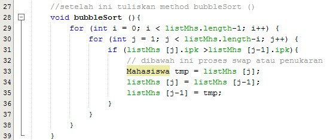
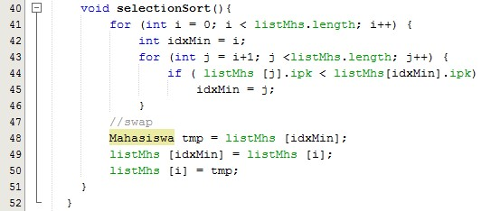
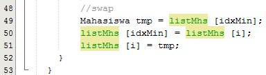
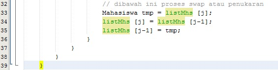
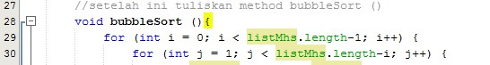
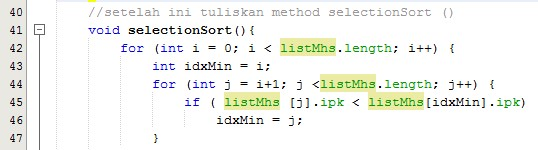

## PRAKTIKUM JOBSHEET 6

# 1.	Ada di line 28 sampai 39 

# 2. 	Ada di line 40 sampai 52 

# 3.	Proses Swap yaitu proses penukaran dengan cara mencari nilai terkecil dari deretan data terlebih dahulu untuk kemudian dilakukan proses penukaran (Swap). 

# 4.	Code program  
# Swap ( penukaran) 

  Untuk melakukan penukaran dimana  Jumlah Iterasi sebesar banyaknya Data. Diatas jumlah datanya ialah 5 maka, jumlah iterasinya ialah 5. Selain itu, setiap iterasi terdapat proses yang jumlahnya ialah sebesar banyaknya Data. Diatas jumlah datanya ialah 5 maka, jumlah proses setiap iterasinya ialah 5. Dan untuk iterasi berikutnya harus dikurang 1. 
Maksudnya yaitu dimana program ini seolah-olah menggeser satu demi satu elemen dari kanan ke kiri atau dari kiri ke kanan tergantung pada jenis pengurutannya. Jenis pengurutan sorting ada 2 yaitu asscending dan descending. Dimana asscending itu mengurut data dari kecil ke besar dan descending itu mengurut data dari besar ke kecil. Jika semua elemen sudah diperiksa oleh fungsi bubble sort, dan tidak ada pertukaran lagi atau semua nilai sudah sesuai, maka saat itu program bubble sort akan berhenti bekerja. Pola Bubble sort yaitu bertukar dengan data sebelahnya. 
 

 # 5.	Code program  
 
 a)	Perulangan  i digunakan untuk pada perulangan i memulai perulangan j dari awal, Sedangkan Perulangan j digunakan untuk perulangan j berada di dalam untuk melakukan penukaran indeks. 
b)	Perulangan i adalah i<listMhs.lenth-1 memenuhi 2 proses perulangan namun dari index 0 
c)	Perulangan j adalah j<listMhs.lenth-i untuk memenuhi 2 proses perulangan namun mulai dari index 1 
d)	Perulangan i akan berlangsung sebanyak 49 kali. Banyak tahap bubbleSort ada  1225 

# 6 Code 
 
  Maksud proses tersebut untuk mencari nilai terkecil untuk dilakukan penukaran. 
Selection sort merupakan metode pengurutan dengan mencari nilai data terkecil dimulai dari data diposisi 0 hingga diposisi N-1. Jika terdapat N data dan data terkoleksi dari urutan 0 sampai dengan N-1. Selama proses, perbandingan dan pengubahan, hanya dilakukan pada indeks permbandingnya saja, pertukaran data secara fisik terjadi pada akhir proses. 

